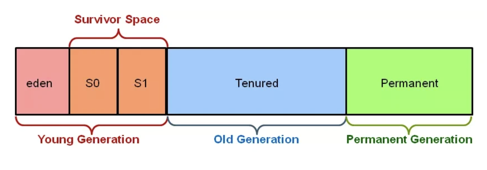

# Java GC

## 判断对象是垃圾的两种方法？

- **引用计数法：**

  在对象中添加一个引用计数器，如果对象被引用，计数器+1，如果引用失效，计数器-1。计数器为0的对象就是垃圾。

  缺点：如果对象之间循环引用，此法失效。

- **可达性分析：**

  通过GC Roots作为起点，通过起点向下遍历，未被遍历到的对象就是垃圾。

  GC Roots的范围：

  - 虚拟机栈中的对象
  - 方法区中类静态属性引用的对象
  - 方法区中常量引用的对象
  - 本地方法栈中JNI引用的对象

## 常用的GC方法：

- **mark-sweep 标记-清除法：**

  遍历所有对象，标记出垃圾对象，然后直接清空。

  简单有效，但会产生很多内存碎片（空闲内存不连续）。

- **mark-copy 标记-复制法：**

  将内存对半分，遍历所有对象，标记出非垃圾对象，将非垃圾对象复制到内存的另一边。

  避免了内存碎片的问题，但是内存浪费很严重。

- **mark-compact 标记-整理法：**

  遍历所有对象，标记出垃圾对象，清空后，将剩下的对象进行整理，避免了上面两种方法的缺点，但同时额外产生了整理的开销。

- **generation-collect 分代收集算法:**

  

  在Hotspot中，内存被分为三大块， **年青代**(Young Generation)，**老年代**(Old Generation)和永久代(Permanent Generation)，年青代又可分为**eden**，**s0**和**s1**三个区。

  对象刚被创建时，被分配在**eden**区，当**eden**区放不下的时候，就发生一次**minor GC**（或者叫young GC），具体为：**标记-清除 eden**， 然后**标记-复制 eden->s0**，经过**minor GC**之后，**eden**就空了，存活下来的对象都进入了**s0**。若下一次**eden**又满了，再进行一次**minor GC**，经过这一次**minor GC****之后存活的在**eden**和**s0**中的对象全部都搬到**s1**。

  对于那些经常在**s0**和**s1**之间搬来搬去的长寿对象，一旦他们的年龄（每搬一次，年龄+1）达到阈值（默认15）， 则会被移到**老年代**当中。

  如果**老年代**也放满了，则会发生**Full GC**（又叫major GC），由于**老年代**的的对象通常会比较多，因为**标记-清理-整理（压缩）**的耗时通常会比较长，会让应用出现卡顿的现象，这也是为什么很多应用要优化，尽量避免或减少 **Full GC** 的原因。

## 垃圾收集器：

### Serial收集器：

单线程，使用标记-复制算法。单线程的好处是避免上下文切换，适用于早期的单核机器。但是在执行期间，会发生STW（Stop The World）。

### Serial Old收集器

单线程，在老年代中使用标记-整理算法。因为老年代的对象比较多，占用的空间会更大。在执行期间会发生STW。

### ParNew收集器

Serial的多线程版本，适用于多核机器。在执行期间会发生STW。

### Parallel Scavenge收集器：

ParNew的升级版本。

提供了两个额外参数：

1. -XX：MaxGCPauseMillis：最大垃圾回收停顿时间
2. -XX：GCTimeRatio：垃圾回收时间与总时间占比

### Parallel Old收集器：

Serial Old的多线程版本。

### CMS（Concurrent Mark Sweep）收集器：

在JDK 7中广泛使用的收集器。主要分为四个阶段

1. **Initial Mark初始标记**：标记GC Root开始的下一级对象。该过程会STW。
2. **Concurrent Mark并发标记**：根据上一步的结果，继续向下标识所有关联的对象，直到尽头。该过程为多线程，且不会STW。
3. **Remark再标记**：由于第二步没有阻塞其他工作线程，其他线程在标识过程中，很有可能会产生新的垃圾。因此需要再标记一次。
4. **Concurrent Sweep并行清理**：并行清理，这里使用多线程以“Mark Sweep-标记清理”算法，把垃圾清掉，其他工作线程仍然能继续执行，不会造成卡顿。

### G1（Garbage First）收集器：

G1将heap内存区划分为一个个大小相等，内存连续的Region区域，每个Region都对应Eden，Survivor，Old，Humongous四种角色之一，但是region和region之间不要求连续。

### ZGC：

从JDK11开始引入。

- 动态调整大小的Region
- 不分代，干掉了RSets
- 带颜色的指针Colored Pointer
- 读屏障Load Barrier
- 重定位relocation
- 多重映射Multi-Mapping
- 支持NUMA架构

## 四种引用的区别：

强引用**(StrongReference)**

以前我们使用的大部分引用实际上都是强引用，这是使用最普遍的引用。如果一个对象具有强引用，那 就类似于必不可少的生活用品，垃圾回收器绝不会回收它。当内存空 间不足，Java虚拟机宁愿抛出 OutOfMemoryError错误，使程序异常终止，也不会靠随意回收具有强引用的对象来解决内存不足问题。

软引用**(SoftReference)**

如果一个对象只具有软引用，那就类似于可有可无的生活用品。如果内存空间足够，垃圾回收器就不会 回收它，如果内存空间不足了，就会回收这些对象的内存。只要垃圾回收器没有回收它，该对象就可以 被程序使用。软引用可用来实现内存敏感的高速缓存。

软引用可以和一个引用队列(ReferenceQueue)联合使用，如果软引用所引用的对象被垃圾回收，JAVA 虚拟机就会把这个软引用加入到与之关联的引用队列中。

弱引用**(WeakReference)**

如果一个对象只具有弱引用，那就类似于可有可无的生活用品。弱引用与软引用的区别在于:只具有弱 引用的对象拥有更短暂的生命周期。在垃圾回收器线程扫描它 所管辖的内存区域的过程中，一旦发现 了只具有弱引用的对象，不管当前内存空间足够与否，都会回收它的内存。不过，由于垃圾回收器是一 个优先级很低的线程， 因此不一定会很快发现那些只具有弱引用的对象。

弱引用可以和一个引用队列(ReferenceQueue)联合使用，如果弱引用所引用的对象被垃圾回收，Java 虚拟机就会把这个弱引用加入到与之关联的引用队列中。

**4**.虚引用(**PhantomReference**) "虚引用"顾名思义，就是形同虚设，与其他几种引用都不同，虚引用并不会决定对象的生命周期。如果一个对象仅持有虚引用，那么它就和没有任何引用一样，在任何时候都可能被垃圾回收。

虚引用主要用来跟踪对象被垃圾回收的活动。

虚引用与软引用和弱引用的一个区别在于: 虚引用必须和引用队列(ReferenceQueue)联合使用。当 垃 圾回收器准备回收一个对象时，如果发现它还有虚引用，就会在回收对象的内存之前，把这个虚引 用加入到与之关联的引用队列中。程序可以通过判断引用队列中是 否已经加入了虚引用，来了解被引 用的对象是否将要被垃圾回收。程序如果发现某个虚引用已经被加入到引用队列，那么就可以在所引用 的对象的内存被回收之前采取必要的行动。

特别注意，在程序设计中一般很少使用弱引用与虚引用，使用软引用的情况􏰀多，这是因为软引用可以 加速**JVM**对垃圾内存的回收速度，可以维护系统的运行安全，防止内存溢出(**OutOfMemory**)等问题的产生。

[back](../)
