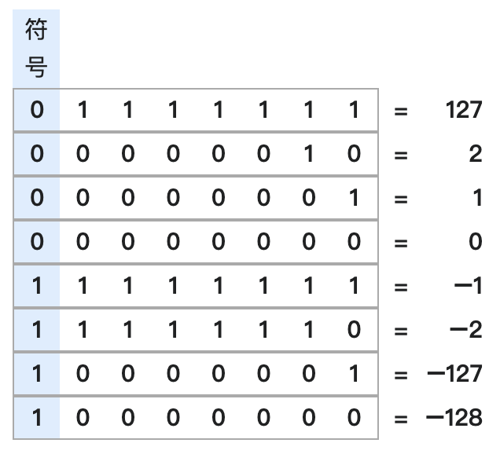

# Java位运算

位运算虽然平时编码不常用（用得好也很厉害），但是面试还是经常会出现的，所以是必须要掌握的内容。

## 基本位运算符号：

- ### 位与（&）：

  **将数字转换成二进制后，若两个操作数的某一位都为1，则结果的该位也是1**

  **5 & 3 = 1**

  5转换为二进制：0000 0000 0000 0000 0000 0000 0000 0101

  3转换为二进制：0000 0000 0000 0000 0000 0000 0000 0011

  1转换为二进制：0000 0000 0000 0000 0000 0000 0000 0001

- ### 位或（｜）：

  **将数字转换成二进制后，若某个操作数的某一位都为1，则结果的该位也是1**

  **5 \| 3 = 7**

  5转换为二进制：0000 0000 0000 0000 0000 0000 0000 0101

  3转换为二进制：0000 0000 0000 0000 0000 0000 0000 0011

  7转换为二进制：0000 0000 0000 0000 0000 0000 0000 0111

- ### 位亦或（^）：

  **将数字转换成二进制后，若两个操作数的某一位不同，则结果的该位是1**

  **5 ^ 3 = 6**

  5转换为二进制：0000 0000 0000 0000 0000 0000 0000 0101

  3转换为二进制：0000 0000 0000 0000 0000 0000 0000 0011

  6转换为二进制：0000 0000 0000 0000 0000 0000 0000 0110

- ### 位非（～）：

  **将数字转换成二进制后，将所有的1变成0，0变成1**

  **～5 = -6**

  5转换为二进制：0000 0000 0000 0000 0000 0000 0000 0101

  -6转换为二进制：1111 1111 1111 1111 1111 1111 1111 1010

- ### 左移（\<\<）：

  **将数字转换成二进制后，将所有的1向左移指定的位数**

  **5 \<\< 2 = 20**

  5转换为二进制：0000 0000 0000 0000 0000 0000 0000 0101

  20转换为二进制：0000 0000 0000 0000 0000 0000 0001 0100

- ### 右移（\>\>）：

  **将数字转换成二进制后，将所有的1向右移指定的位数**

  **5 \>\> 2 = 1**

  5转换为二进制：0000 0000 0000 0000 0000 0000 0000 0101

  1转换为二进制：0000 0000 0000 0000 0000 0000 0000 0001

- ### 无符号右移（\>\>\>）：

  Java当中，二进制第一位是1代表这个数是负数，第一位是0则代表这个数是正数。

  **正数无符号右移时，高位用0补：**

  **5 \>\>\> 2 = 1**

  5转换为二进制：0000 0000 0000 0000 0000 0000 0000 0101

  1转换为二进制：0000 0000 0000 0000 0000 0000 0000 0001

  **负数无符号右移时，高位用1补：**

  **-5 \>\>\> 2 = -1**

  5转换为二进制：1111 1111 1111 1111 1111 1111 1111 1010

  1转换为二进制：1111 1111 1111 1111 1111 1111 1111 1110

## 补码：

聊到二进制了，顺便再聊聊补码

**补码**（英语：**2's complement**）是一种用二进制表示有符号数的方法，也是一种将数字的正负号变号的方式。补码以有符号比特的二进制数定义。

**正数和0的补码就是该数字本身。负数的补码则是将其对应正数按位取反再加1。**

## 反码：

和补码不同的是，反码只是将该数字的每一位从0变成1或者从1变成0，**并不需要再加一**

### 值得注意的是，在反码当中，0有两种表示方法：

每一位都是0或者每一位都是1

[back](../)

