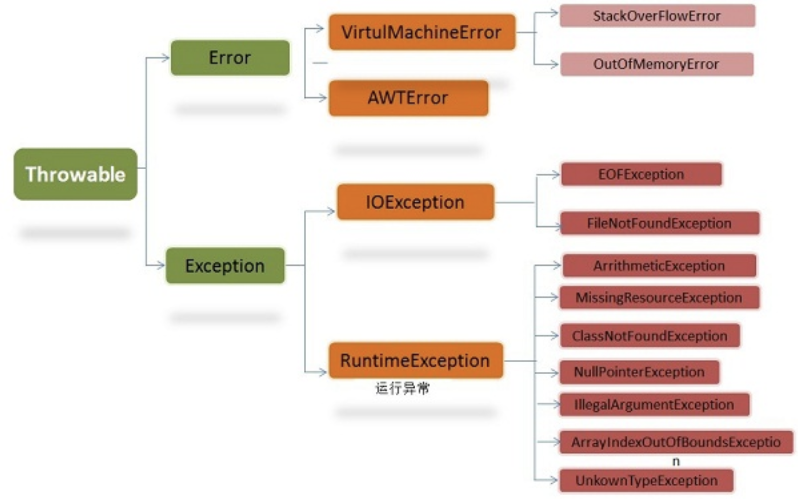

# Java异常处理

## Java异常类层次结构图

在Java中，所有的异常的共同祖先为java.lang包中的Throwable类。Throwable又包含了两个重要的子类：**Excepion**和**Error**。

**Error(错误)：**程序无法处理的错误，表示程序中较为严重的问题。大部分错误和和代码编写者的操作无关，而表示代码运行时JVM出现的问题。例如，Java虚拟机运行错误（Virtual MachineError），当JVM不再有继续执行操作所需的内存资源时，将出现OutOfMemoryError。这些异常发生时，Java虚拟机（JVM）一般会选择线程终止。

**Exception(异常)：**是程序本身可以处理的异常。**RuntimeException**是一个重要的子类。

因此，异常和错误的最大区别在于：异常能被程序本身处理，错误是无法处理的。

### Throwable类常用方法：

- public string getMessage():返回异常发生时的简要概述。
- public string toString():返回异常发生时的详细信息。
- public string getLocalizedMessage():返回异常对象的本地化方法。
- Public void printStackTrace():在控制台上打印Throwable对象封装的异常信息。

### 异常处理总结：

- **try块：**用于捕获异常。其后可接0个或多个catch块，如果没有catch块，则必须跟一个finally块。
- **catch块：**用于处理try捕获到的异常。
- **finally块：**无论是否捕获或处理异常，finally块里的语句都会被执行。当在try块或catch块中遇到return时，finally语句块将在方法返回之前被执行。

### finally不会被执行的四种特殊情况：

- 在finally语句块的第一行发生了异常。
- 在前面的代码中使用了System.exit(int)退出了程序。
- 程序所在的线程死亡。
- 关闭CPU。

[back](../)
