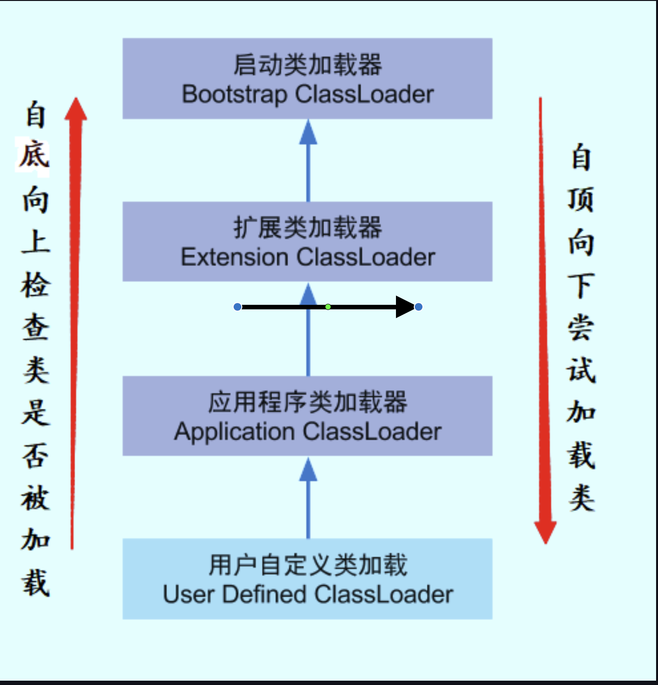

# Java类的加载：

这里主要是整理一下不太常见的关于Java的知识点：

## 类的加载顺序

有父子关系的类在加载时，先调用父类静态初始化块，静态属性，但不包括静态方法，然后再是，子类静态初始化块，静态属性，但同样不包括静态方法 。

## 类加载的过程：

**加载->连接->初始化**

加载过程：

1. 通过全类名获取定义此类的二进制字节流
2. 将字节流所代表的静态存储结构转换为方法区的运行时数据结构
3. 在内存中生成一个代表该类的 Class 对象,作为方法区这些数据的访问入口

连接步骤可分为：验证->准备->解析

## 对象创建的过程：

1. 类加载检查: 虚拟机遇到一条new指令时，首先将去检查这个指令的参数是否能在常量池中定位到这个类的符号引用，并且检查这个符号引用代表的类是否已被加载过、解析和初始化过。如果没有，那必须先执行相应的类加载过程。

2. 分配内存: 在类加载检查通过后，接下来虚拟机将为新生对象**分配内存**。对象所需的内存大小在类加载完成后便可确定，为对象分配空间的任务等同于把一块确定大小的内存从 Java 堆中划分出来。分配方式有 **“**指针碰撞**”** 和 **“**空闲列表**”** 两种，选择那种分配方式由 **Java** 堆是否规整决定，而**Java**堆是否规整又由所采用的垃圾收集器是否带有压缩整理功能决定。

   ##### 分配内存的两种方式：

   选择以上两种方式中的哪一种，取决于 Java 堆内存是否规整。而 Java 堆内存是否规整，取决于 GC 收集器的算法是"标记-清除"，还是"标记-整理"(也称作"标记-压缩")，值得注意的是，复制算法内存也是规整的。

   ##### 内存分配并发问题：

   在创建对象的时候有一个很重要的问题，就是线程安全，因为在实际开发过程中，创建对象是很频繁的事情，作为虚拟机来说，必须要保证线程是安全的，通常来讲，虚拟机采用两种方式来保证线程安全:

   **CAS+失败重试**: CAS 是乐观锁的一种实现方式。所谓乐观锁就是，每次不加锁而是假设没有冲 突而去完成某项操作，如果因为冲突失败就重试，直到成功为止。虚拟机采用 **CAS** 配上失败重 试的方式保证更新操作的原子性。
    **TLAB**: 为每一个线程预先在Eden区分配一块儿内存，JVM在给线程中的对象分配内存时，首先在 TLAB分配，当对象大于TLAB中的剩余内存或TLAB的内存已用尽时，再采用上述的CAS进行内存分配

3. 初始化零值: 内存分配完成后，虚拟机需要将分配到的内存空间都初始化为零值(不包括对象头)，这一步操作保证了对象的实例字段在 Java 代码中可以不赋初始值就直接使用，程序能访问到这 些字段的数据类型所对应的零值。

4. 初始化零值完成之后，虚拟机要对对象进行必要的设置，例如这个对象是哪个类的实例、如何才能找到类的元数据信息、对象的哈希码、对象的GC分代年龄等信息。 这些信息存放在对象头中。 另外，根据虚拟机当前运行状态的不同，如是否启用偏向锁等，对象头会有不同的设置方式。

5. 执行 **init** 方法: 在上面工作都完成之后，从虚拟机的视⻆来看，一个新的对象已经产生了，但从 Java 程序的视⻆来看，对象创建才刚开始，<init>方法还没有执行，所有的字段都还为零。所以一般来说，执行new指令之后会接着执行 <init> 方法，把对象按照程序员的意愿进行初始化，这样一 个真正可用的对象才算完全产生出来。

## 两种访问对象定位的方式：

- **句柄：**如果使用句柄的话，那么Java堆中将会划分出一块内存来作为句柄池，reference 中存储的就是对象的句柄地址，而句柄中包含了对象实例数据与类型数据各自的具体地址信息。
- **直接指针：**如果使用直接指针访问，那么 Java 堆对象的布局中就必须考虑如何放置访问类型数据的相关信息，而reference 中存储的直接就是对象的地址。

这两种对象访问方式各有优势。使用句柄来访问的最大好处是 **reference** 中存储的是稳定的句柄地址，在对象被移动时只会改变句柄中的实例数据指针，而 **reference** 本身不需要修改。使用直接指针访问方式最大的好处就是速度快，它节省了一次指针定位的时间开销。

## 有哪些类加载器？

1. **BootstrapClassLoader(**启动类加载器**)** :最顶层的加载类，由C++实现，负责加载 %JAVA_HOME%/lib 目录下的jar包和类或者或被 -Xbootclasspath 参数指定的路径中的所有类。
2. **ExtensionClassLoader(**扩展类加载器**)** :主要负责加载目录 %JRE_HOME%/lib/ext 目录下的jar 包和类，或被 java.ext.dirs 系统变量所指定的路径下的jar包。
3. **AppClassLoader(**应用程序类加载器**)** :面向我们用户的加载器，负责加载当前应用classpath下所有jar包和类。

## 什么是双亲委派模型？

每一个类都有一个对应它的类加载器。系统中的 ClassLoder 在协同工作的时候会默认使用 双亲委派 模型 。即在类加载的时候，系统会首先判断当前类是否被加载过。已经被加载的类会直接返回，否则 才会尝试加载。加载的时候，首先会把该请求委派该父类加载器的 **loadClass()** 处理，因此所有的请 求最终都应该传送到顶层的启动类加载器 **BootstrapClassLoader** 中。当父类加载器无法处理时，才由 自己来处理。当父类加载器为null时，会使用启动类加载器 BootstrapClassLoader 作为父类加载器。

[back](../)

